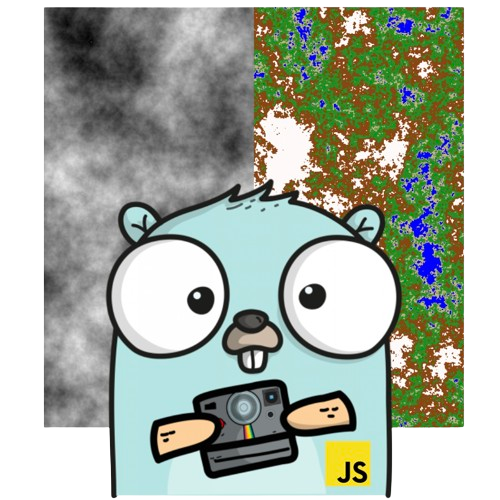

<a name="readme-top"></a>

[![Contributors][contributors-shield]][contributors-url]
[![Forks][forks-shield]][forks-url]
[![Stargazers][stars-shield]][stars-url]
[![Issues][issues-shield]][issues-url]

<!-- PROJECT LOGO -->
<br />
<div align="center">
  <a href="https://github.com/CGuilhem/Perlin-Noise">
    
  </a>

<h3 align="center">Perlin Noise</h3>

  <p align="center">
    A simple perlin noise generator built with Go and JavaScript
    <br />
    <a href="https://github.com/CGuilhem/Perlin-Noise"><strong>Explore the docs »</strong></a>
    <br />
    <br />
    <a href="https://github.com/CGuilhem/Perlin-Noise">View Demo</a>
    ·
    <a href="https://github.com/CGuilhem/Perlin-Noise/issues">Report Bug</a>
    ·
    <a href="https://github.com/CGuilhem/Perlin-Noise/issues">Request Feature</a>
  </p>
</div>

<!-- TABLE OF CONTENTS -->
<details>
  <summary>Table of Contents</summary>
  <ol>
    <li>
      <a href="#about-the-project">About The Project</a>
      <ul>
        <li><a href="#built-with">Built With</a></li>
      </ul>
    </li>
    <li>
      <a href="#getting-started">Getting Started</a>
      <ul>
        <li><a href="#prerequisites">Prerequisites</a></li>
        <li><a href="#installation">Installation</a></li>
      </ul>
    </li>
    <li><a href="#usage">Usage</a></li>
    <li><a href="#roadmap">Roadmap</a></li>
    <li><a href="#contributing">Contributing</a></li>
    <li><a href="#license">License</a></li>
    <li><a href="#contact">Contact</a></li>
    <li><a href="#acknowledgments">Acknowledgments</a></li>
  </ol>
</details>

<!-- ABOUT THE PROJECT -->

## About The Project 📔

This project is a Perlin noise generator written in Go. It includes several modules for generating Perlin noise images, terrain maps (via the Go module or a web server linked to a front-end), and for using the generated noise to integrate it into a Go 2D engine (Ebiten), in order to generate special effects.

<p align="right">(<a href="#readme-top">back to top</a>)</p>

### Built With 🏗️

[![Go][Go]][Go-url] [![JavaScript][Javascript]][JavaScript-url]

<p align="right">(<a href="#readme-top">back to top</a>)</p>

<!-- GETTING STARTED -->

## Getting Started 🎉

### Prerequisites

- [Go](https://go.dev/dl/)
- [Node.js](https://nodejs.org/en/download)

### Installation

1. **Clone the repo**
   ```sh
   git clone https://github.com/CGuilhem/Perlin-Noise.git
   ```
2. **Install front-end packages**
   ```sh
   cd Perlin-Noise
   cd JavaScript
   npm i
   ```
3. **Run front-end application**
   ```sh
   Launch the index.html file with your favorite web browser
   ```
4. **Install back-end packages**

   ```sh
     cd Perlin-Noise/Go/perlin
     go get
     cd ../server
     go get
     cd ../simplex
     go get
     cd ../shader
     go get
   ```

5. **Run back-end application**

   ```sh
    shader :
    cd Perlin-Noise/Go/perlin
    go run main.go to generate a perlin noise
    go run main.go -map to generate a map

    server:
    cd Perlin-Noise/Go/server
    go run main.go

    shader:
    cd Perlin-Noise/Go/shader
    go run main.go
   ```

<p align="right">(<a href="#readme-top">back to top</a>)</p>

<!-- USAGE EXAMPLES -->

## Usage 💻

🚧 You can already generate perlin noise and maps, but several other features are currently under development.

<p align="right">(<a href="#readme-top">back to top</a>)</p>

<!-- ROADMAP -->

## Roadmap 🗺️

See the [open issues](https://github.com/CGuilhem/Perlin-Noise/issues) for a full list of proposed features (and known issues).

<p align="right">(<a href="#readme-top">back to top</a>)</p>

<!-- CONTRIBUTING -->

## Contributing 🫂

Contributions are what make the open source community such an amazing place to learn, inspire, and create. Any contributions you make are **greatly appreciated**.

If you have a suggestion that would make this better, please fork the repo and create a pull request. You can also simply open an issue with the tag "enhancement".
Don't forget to give the project a star! Thanks again!

1. Fork the Project
2. Create your Feature Branch (`git checkout -b feature/AmazingFeature`)
3. Commit your Changes (`git commit -m 'Add some AmazingFeature'`)
4. Push to the Branch (`git push origin feature/AmazingFeature`)
5. Open a Pull Request

<p align="right">(<a href="#readme-top">back to top</a>)</p>

<!-- LICENSE -->

<!-- CONTACT -->

## Contact 📇

Project Link: [https://github.com/CGuilhem/Perlin-Noise](https://github.com/CGuilhem/Perlin-Noise)

<p align="right">(<a href="#readme-top">back to top</a>)</p>

<!-- ACKNOWLEDGMENTS -->

## Acknowledgments 🙏

- [Thomas DUARTE](https://github.com/ThomasDuarte)
- [Alexandre PROUST](https://github.com/AlexPst-Dev)

<p align="right">(<a href="#readme-top">back to top</a>)</p>

<!-- MARKDOWN LINKS & IMAGES -->
<!-- https://www.markdownguide.org/basic-syntax/#reference-style-links -->

[contributors-shield]: https://img.shields.io/github/contributors/CGuilhem/Perlin-Noise.svg?style=for-the-badge
[contributors-url]: https://github.com/CGuilhem/Perlin-Noise/graphs/contributors
[forks-shield]: https://img.shields.io/github/forks/CGuilhem/Perlin-Noise.svg?style=for-the-badge
[forks-url]: https://github.com/CGuilhem/Perlin-Noise/network/members
[stars-shield]: https://img.shields.io/github/stars/CGuilhem/Perlin-Noise.svg?style=for-the-badge
[stars-url]: https://github.com/CGuilhem/Perlin-Noise/stargazers
[issues-shield]: https://img.shields.io/github/issues/CGuilhem/Perlin-Noise.svg?style=for-the-badge
[issues-url]: https://github.com/CGuilhem/Perlin-Noise/issues
[license-shield]: https://img.shields.io/github/license/CGuilhem/Perlin-Noise.svg?style=for-the-badge
[license-url]: https://github.com/CGuilhem/Perlin-Noise/blob/master/LICENSE.txt
[linkedin-shield]: https://img.shields.io/badge/-LinkedIn-black.svg?style=for-the-badge&logo=linkedin&colorB=555
[Go]: https://img.shields.io/badge/Go-79c7df?style=for-the-badge&logo=go&logoColor=blue
[Go-url]: https://go.dev/
[JavaScript]: https://img.shields.io/badge/JavaScript-ebd94e?style=for-the-badge&logo=javascript&logoColor=black
[JavaScript-url]: https://developer.mozilla.org/fr/docs/Web/JavaScript
